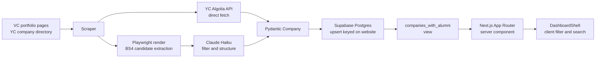

# Startup Map

A free, public dashboard helping Vanderbilt undergrads discover and research vetted early stage startups for internships. Built from scratch as a solo project to ship a real product end to end: a Python scraper that pulls from VC portfolio pages and Y Combinator, a Supabase Postgres database, and a Next.js frontend on Vercel. Architected to expand to other top schools once Vanderbilt is validated.


Built by [Elliott Cho](https://www.linkedin.com/in/elliotteycho), CS and HOD at Vanderbilt. Spec, decisions, and build log live in [`docs/`](docs/).

## Why this exists

Existing options for student startup discovery either drown you (Wellfound, 12,000+ jobs) or are corporate by design (Handshake). YC's Work at a Startup is the closest comparable, with 5,000 active companies and high response rates, but it has no school filter and no notion of who at your school already works there.

This product makes a different bet. Curate to 100 to 200 early stage companies for one specific audience. Tag each one with which Vanderbilt alumni already work there. Track which companies actually reply to applications over time. None of those data layers exist anywhere at any price for Vanderbilt specifically.

Full strategic thesis, competitive analysis, and 90 day kill criteria are in [`docs/spec.md`](docs/spec.md).

## What's interesting about how this was built

A few decisions that were not obvious going in and that took some sharpening on the way.

**Hybrid LLM plus CSS extraction.** Pure CSS selectors do not scale across 245 snowflake VC portfolio sites. Pure LLM extraction is too expensive to run weekly at that scale (1 to 5 cents per page). The scraper extracts plausible portfolio company links with BeautifulSoup, filters by domain and URL path with a hand tuned regex set, then passes the survivors to Claude Haiku to identify which are real companies and structure the metadata. The full reasoning is in [`docs/scraper-design.md`](docs/scraper-design.md).

**YC via Algolia, not Playwright.** YC's company directory loads through a public Algolia search index. The read only API key sits in `window.AlgoliaOpts` on the page source. A 10 line regex pulls the key, then a single POST to Algolia returns up to 1,000 hiring companies for a batch. Bypasses a full browser launch and is roughly 100x faster than scraping the rendered page.

**Multi school from day 1.** The `schools` table exists in migration 001 with Vanderbilt as row 1. School is a parameter through the codebase, never a hardcoded constant. The 30 minute upfront cost prevents a major refactor in Phase 3 when expanding to peer schools.

**Pydantic as the contract.** A single `Company` model in `scraper/models.py` is the source of truth for what a row looks like. Both extractors (LLM and YC) produce instances of it. The Supabase serializer is a method on the model. Adding a new field is one change, not three.

**Row Level Security on day 1.** Every Supabase table has RLS enabled from migration 001. Public read policies on the data tables, writes only via the service role key used by the scraper. The default Supabase setup is the most common cause of public data leaks in side projects; enabling RLS from day 1 prevents the failure mode entirely.

The full Architectural Decision Records, including alternatives considered for each call, are in [`docs/decisions.md`](docs/decisions.md).

## Architecture



Full data flow walkthrough, including failure modes and design tradeoffs, in [`docs/architecture.md`](docs/architecture.md).

## Current status

Honest read as of May 2026.

**Working.** Schema deployed to Supabase with RLS and seed data. Scraper extracts companies end to end from Founders Fund, Sequoia, Khosla, Greylock, General Catalyst, Lightspeed, and three YC batches (W25, S24, W24). Dashboard renders, filters, searches, and links to per company detail pages. Click tracking is wired into the `events` table from day 1. Frontend deployed to Vercel.

**In progress.** Expanding the scraper to 20+ VC portfolio sources. Wiring the scraper into a Render cron for weekly refresh. Adding the Vanderbilt alumni layer (currently sparse, populated manually for seed companies only).

**Not yet started.** Soft launch to 10 to 20 Vanderbilt students. Response verification tracking (which startups actually reply within 14 days). Public launch.

## Tech stack

Frontend is Next.js 16 with the App Router, React 19, TypeScript, and Tailwind CSS 4, deployed on Vercel.

Backend is Supabase managed Postgres with Row Level Security, accessed via the auto generated REST API.

Scraper is Python 3.11 using Playwright for JavaScript heavy pages, BeautifulSoup for HTML parsing, the Anthropic SDK with Claude Haiku for cost efficient extraction, Pydantic for data validation, and httpx for the YC Algolia direct path. Designed to run as a Render Cron Job on a weekly schedule.

## Repo layout

```
startup-dashboard/
├── web/         Next.js frontend, deployed to Vercel
├── scraper/     Python pipeline, runs weekly on Render
├── schema/      SQL migrations applied via Supabase SQL editor
├── docs/        Spec, ADRs, architecture, scraper design, build log
└── assets/      Screenshots and diagrams referenced from docs
```

Each top level folder has its own README with the local conventions.

## Run it yourself

Prerequisites: Node.js 18+, Python 3.11+, a free tier Supabase project, an Anthropic API key.

**Frontend.**

```bash
cd web
cp .env.local.example .env.local
# Fill in NEXT_PUBLIC_SUPABASE_URL and NEXT_PUBLIC_SUPABASE_ANON_KEY
npm install
npm run dev
```

Open http://localhost:3000.

**Scraper.**

```bash
cd scraper
python3.11 -m venv venv
source venv/bin/activate
pip install -r requirements.txt
playwright install chromium
cp .env.example .env
# Fill in SUPABASE_URL, SUPABASE_SERVICE_ROLE_KEY, ANTHROPIC_API_KEY
python smoke_test.py founders
```

If the smoke test prints a list of Founders Fund portfolio companies, the full pipeline works. Then run `python pipeline.py` to scrape and upsert all default sources.

**Database.**

Apply migrations in order via the Supabase SQL Editor: `001_initial.sql`, `002_seed_dev.sql`, `003_fix_slug_constraint.sql`. The seed migration is optional, useful for local development before the scraper has been run.

## Documentation index

[Specification](docs/spec.md) covers the locked v1 requirements, the competitive analysis, the three layer competitive edge thesis, and the 90 day kill criteria.

[Architectural Decisions](docs/decisions.md) records every major technical call with alternatives considered. Each ADR is append only; revisions are written as follow up entries.

[Architecture](docs/architecture.md) is the engineering deep dive. End to end data flow, where each piece runs, and the failure modes that drove specific design choices.

[Scraper Design](docs/scraper-design.md) walks through the hybrid LLM plus CSS extraction strategy, the YC Algolia direct fetch, and the Pydantic contract pattern.

[Build Log](docs/build-log.md) is a phase by phase narrative of what shipped when, drawn from commits and ADRs. Useful for reading the project as a story rather than a snapshot.

[Retrospectives](docs/retros.md) are the weekly Friday entries on what shipped, what slipped, and what to change.

## License

MIT. See [LICENSE](LICENSE).
