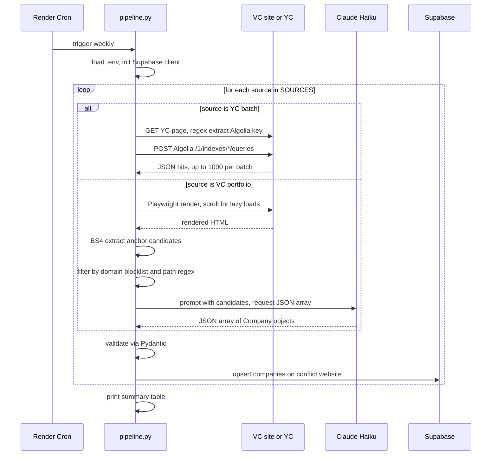
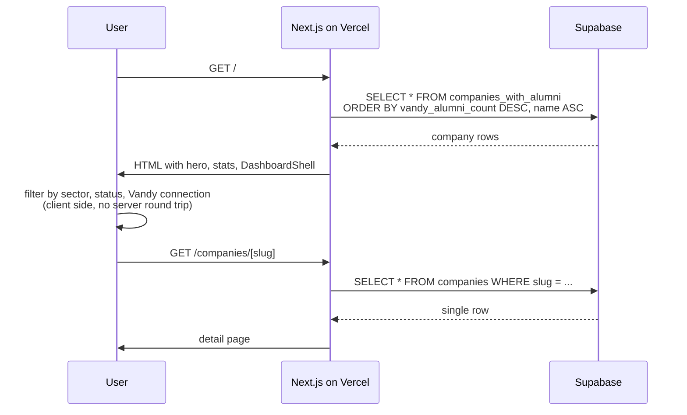

# Architecture

End to end data flow, where each component runs, and the failure modes that drove specific design choices. Engineering tone. If you want the strategic thesis, read [`spec.md`](spec.md). If you want the scraper internals specifically, read [`scraper-design.md`](scraper-design.md).

## Components at a glance

```
[VC portfolio pages]   [YC company directory]
        |                       |
        | Playwright            | httpx + regex
        | BS4 candidate         | YC Algolia API
        | extraction            | direct fetch
        |                       |
        +---> [Claude Haiku] <--+
              (filter + structure)
                   |
                   v
           [Pydantic Company]
                   |
                   v
        [Supabase Postgres]
        - RLS on every table
        - upsert keyed on website
                   |
                   v
   [companies_with_alumni view]
                   |
                   v
   [Next.js server component]
                   |
                   v
   [DashboardShell client]
   filter, search, render
```

## Where each piece runs

The frontend is a Next.js 16 app deployed to Vercel. The home page is a server component that reads from Supabase on each request (`export const dynamic = "force-dynamic"`) and passes the company list to a client component called `DashboardShell` for filter and search state.

The scraper is a Python 3.11 pipeline. Locally during development it runs from `scraper/pipeline.py`. In production it is designed to run as a Render Cron Job on a weekly schedule (not yet wired). The scraper writes to Supabase using the service role key, which bypasses Row Level Security.

The database is Supabase managed Postgres. The frontend reads through the auto generated REST API using the public anon key, which is safe to expose because Row Level Security on every table restricts access to read only for public data and insert only for the events tracking table.

## Request lifecycle, weekly scrape



## Request lifecycle, user views dashboard



## Schema

Five concepts, four tables and one view.

`schools` has Vanderbilt as row 1 and is the multi school anchor. Every query that scopes to a school joins through it. Adding a peer school is one INSERT.

`companies` is the core table. 12 product fields plus `created_at`, `updated_at`, `last_scraped_at`, `source_fund`, and a derived `slug`. Unique constraint on `website` is the canonical key; the scraper uses upsert with `on_conflict="website"` so re running the pipeline is idempotent.

`alumni` links a school to companies through Vanderbilt alumni currently working there. Sparse in v1, populated manually for seed companies. Phase 2 work will populate this from LinkedIn data.

`events` captures every meaningful user interaction (view, click, filter change) tied to a session ID with no PII. Public can insert, no one can read. This table is the seed for the Phase 3 response verification data moat: cross referencing applications with response rates over time.

`companies_with_alumni` is a convenience view that joins `companies` to a count of Vanderbilt alumni per company. The frontend reads from this view directly so it never has to do the join client side.

Full DDL is in [`schema/001_initial.sql`](../schema/001_initial.sql). Migrations 002 (dev seed data) and 003 (drop unused unique constraint on slug) follow.

## Failure modes and how they shaped the design

**Supabase tables are public by default.** The most common Supabase security failure is forgetting to enable Row Level Security and exposing the database via the auto generated REST API. RLS is enabled in migration 001 on every table with explicit policies, not later. See [ADR 004](decisions.md).

**Same company across multiple VC portfolios.** Ramp shows up in Founders Fund's portfolio and a16z's portfolio and Khosla's. The slug "ramp" would collide three ways. The original schema had a unique constraint on slug; migration 003 drops it and keeps the unique constraint on `website` only, with a plain index on slug for query performance.

**VC sites that never reach networkidle.** Some VC portfolio pages have constant background activity (ads, analytics) and Playwright's `wait_until="networkidle"` never fires. The smoke test used `networkidle`; the production pipeline uses `wait_until="domcontentloaded"` followed by an explicit 3 second sleep and 15 scroll iterations. This handles slow loaders without timing out.

**a16z's portfolio is a heavy SPA.** Standard anchor tag extraction returns nothing usable because the company links are rendered behind a React routing layer rather than as static `<a>` elements. The a16z source is in the legacy `_deferred/` folder with a header explaining the deferral. The pattern that does work for similar sites is the YC approach: find the underlying API and hit it directly.

**LLM returns invalid JSON.** Roughly 1 in 50 Haiku responses come back wrapped in a markdown fence or with a leading explanation. The `_extract_json_array` helper handles both, logging the raw response preview if parsing still fails so the source can be investigated. No retries; a failed source just contributes zero rows that week.

## How the frontend stays simple

The dashboard does almost everything client side after the initial load. The server component fetches once and passes the full list (typically a few hundred rows) into `DashboardShell`, which holds search text, hiring status, sector filter, and a "Vandy connections only" toggle in `useState`. Filtering happens in `useMemo` over the in memory array. No infinite scroll, no pagination, no server side filtering. At v1 scale, this is the simplest design that works.

Per company detail pages at `/companies/[slug]` are separate server components that fetch one row. Routes are dynamic, no static generation, no ISR.

The events table is wired through `lib/track.ts`, which fires anonymous session scoped inserts directly into Supabase from the client. Anon key has insert privileges on `events` via the RLS policy.

## What is intentionally not here in v1

No authentication. No user accounts. No saved companies. No email alerts. No application tracking. These are all explicitly out of scope per the spec. Each one is a real product, and adding them in v1 would slow down validation of the core thesis.

No backend API service. Supabase's auto generated REST API is the backend. The Next.js app talks to it directly using the public anon key.

No queueing or job orchestration. The scraper is a single Python process that runs sequentially through sources. At v1 scale (7 sources, ~30 minute total runtime) this is fine. A queue is appropriate at 50+ sources.

No CDN beyond what Vercel provides. No image optimization beyond Next.js defaults. No analytics tooling beyond what is wired into the `events` table.

Simplicity here is a feature. Every piece that is not in v1 is one that does not have to work for launch.
